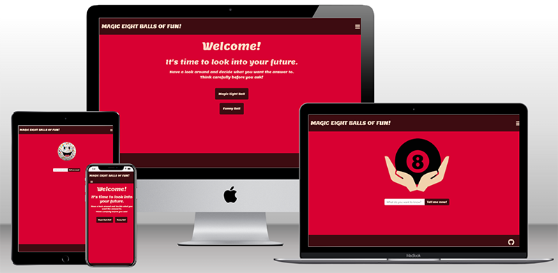

# Magic Eight Ball
---

[View the live project here](https://debbiepotts87.github.io/magic-eight-ball/index.html)

A basic game website to show contitional and control flow statements.

---

# Technology Used

## Languages Used
[HTML5](https://en.wikipedia.org/wiki/HTML5)

[CSS3](https://en.wikipedia.org/wiki/CSS)

[JavaScript](https://en.wikipedia.org/wiki/JavaScript)

## Frameworks, Libraries & Programs Used
1. [Visual Studio Code](https://code.visualstudio.com/)
    * Visual Studio Code was used to complie the code to complete the website.
2. [Git](https://git-scm.com/)
    * Git was used for version control
3. [Github](https://github.com/)
    * Github is used to store the code
4. [Bootstrap 5.3](https://getbootstrap.com/)
    * Bootstrap was used to assist with the styling and responsivness of the site
5. [Chrome Dev Tools](https://developer.chrome.com/docs/devtools/)
    * Chrome Dev Tools was used to debug minor issues and as an aid when styling the website
6. [Google Fonts](https://fonts.google.com/)
    * Used for the typography for a modern but easy to read design
7. [Font Awesome](https://fontawesome.com/icons)
    * Font Awesome was used to add styling to the site through icons

---

# Credits

## Code

* Navigation section
    * [Bootstrap documentation](https://getbootstrap.com/docs/5.3/getting-started/introduction/) as a guide for making the responsive navigation bar

* [W3 Schools](https://www.w3schools.com/)
    * Used throughout the project to trouble shoot

## Content

* All content was written by the developer

## Media

* [Images from Clean PNG](https://www.cleanpng.com/)